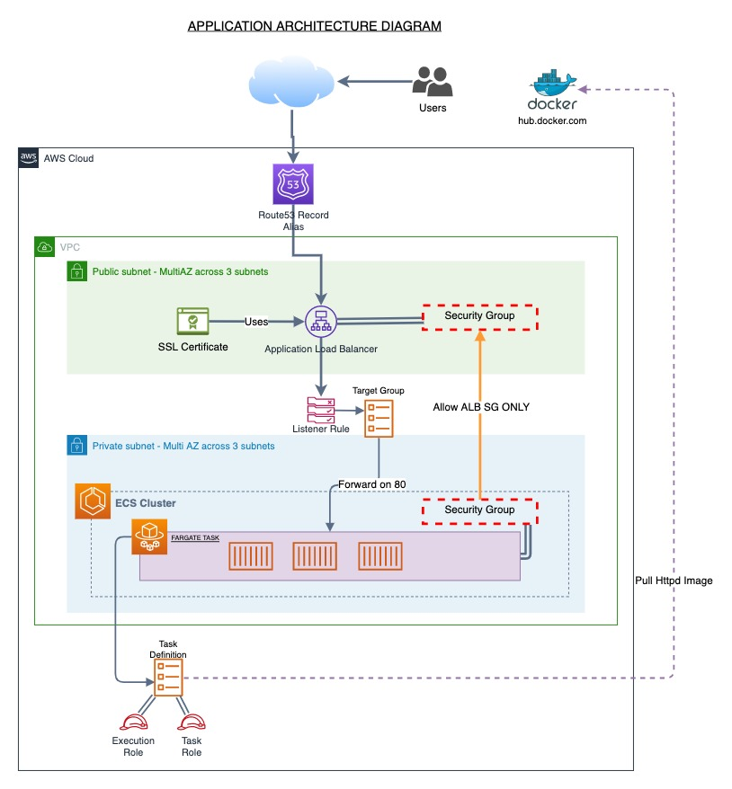

# Infrastructure Challenge

### Result Format

The result will consist of either of the following:
- Three separate files committed to the repo with the challenges listed at all three stages.

---

## CASE-STUDY
Our architecture team have supplied us with this infrastructure diagram with an aim to fully automate the implementation using Infrastructure as Code and CI/CD.



## Task 1: Infrastructure as Code Template

You have been asked to create a `yaml` formatted CloudFormation template **OR** a Terraform template for the above diagram. Our heros from the network team have already created the networking level components (like the VPC, Subnets, NAT Gateways for public internet routing) and have provided the required IDs and ARNs below:

### The Challenge
Create an Infrastructure as Code (IaC) template using the IDs provided below wherever necessary.

```yaml
PublicSubnetIds:
  - "pub--7eqwhyn6rn"
  - "pub--54wxuuz4yz"
  - "pub--y5wdouvoar"

PrivateSubnetIds:
  - "priv--whyn6rn7eq"
  - "priv--uuz4yz54wx"
  - "priv--uvoary5wdo"

VpcId: "x567hhdz"

Route53HostedZoneId: "xcf4435z"

Route53HostedZoneName: "mmt_tech_test_zone"

AcmCertificateArn: "arn:aws:acm:eu-west-1:8877665544:certificate/123456789012-1234-1234-1234-12345678"
```
---

## Task 2: Consuming AWS SSM Parameters

### Context
The networking team have gone above and beyond and started an innitiative of de-coupling resources created by them (like VPCs and Subnets) with supporting infrastructure which is created by engineers in our organisation. 

### The Challenge
In order for them to succeed at this, you have been asked to replace any use of the IDs which were provided to you in your first task with resolved SSM Parameter values for the below paths:
```yaml
PrivateSubnetIdSSM: /mmt/subnets/private/subnet-ids

PublicSubnetIdSSM: /mmt/subnets/public/subnet-ids

VpcIdSSM: /mmt/vpc/vpc_id

Route53HostedZoneIdSSM: /mmt/dns/r53_zone_id

Route53HostedZoneNameSSM: /mmt/dns/r53_zone_name

AcmCertificateArn: /mmt/acm/tech_test_ssl_arn
```

## Task 3: Cost Optimisation

Everyone is really happy that we have come so far at MMT and now want to save costs wherever we can. Our Cloud Architects have recommended that we upgrade our ECS clusters to now use Spot instances and 100% Fargate Spot capacity providers only, for all our non-production environments.

### The Challenge

Upgrade our ECS cluster and service to use Fargate Spot **only** if the environment name does not match `production`. If the environment is production, continue using the general Fargate capacity provider.